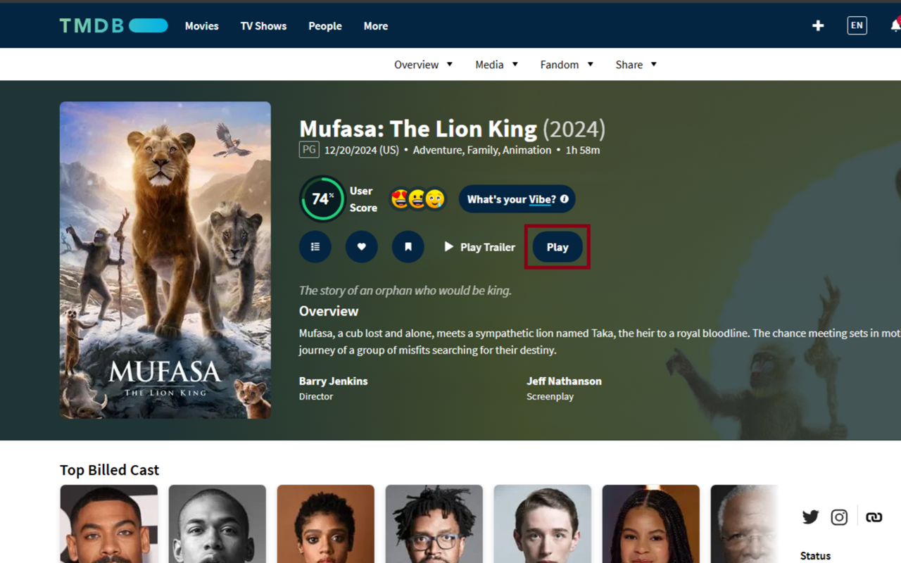
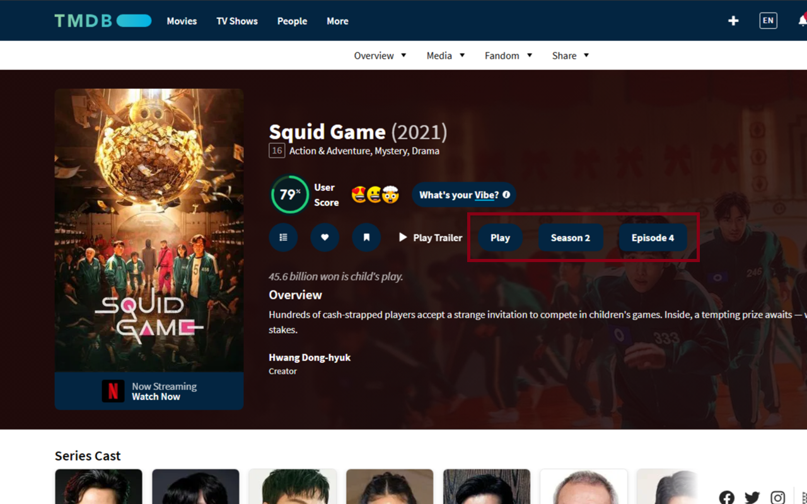
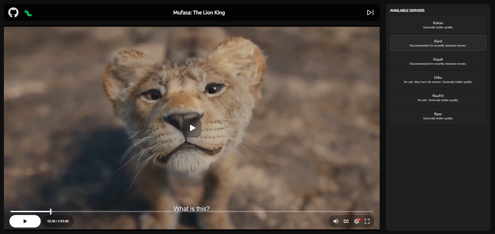

# TMDB Player

TMDB Player is a browser extension designed to enhance your movie and TV show experience on the [TMDB website](https://www.themoviedb.org/). This extension adds a custom play button to TMDB pages, allowing you to stream movies and TV shows for free from various video streaming servers.

---

## Features

- **Custom Play Button:** Automatically adds a custom play button next to the existing TMDB "Play Trailer" button when viewing a movie or TV show page.
- **Free Streaming:** Opens a new tab with a webpage to stream the selected movie or TV show.
- **Multiple Streaming Servers:** Choose from different video streaming servers (Server 1, Server 2, ...). Server 1 or Server 2 is recommended for the best experience if available.
- **Minimal Ads:** While the TMDB site itself is ad-free, the player webpage may display minimal ads. Using an ad blocker is recommended for an uninterrupted experience.

---

## Installation

### Install from available Stores

**Note:** Chromium-based browsers like Opera, Brave, Edge, etc., can also install the extension from the **Chrome Web Store**.

### For iPhone (iOS) and iPad (iPadOS)

1. Install the **Orion Browser** from the App Store:  
     
   Orion Browser allows you to install add-ons from both the Chrome and Firefox stores.
2. Open the Orion Browser and navigate to the **Firefox Add-ons Store**.
3. Search for **TMDB Player** and install the extension.
4. (Optional/Recommendation) You can also install **uBlock Origin** or other adblock of your liking from these stores.

### Manual Installation

#### For Chromium-based Browsers (Chrome, Edge, Opera, etc.)
1. Download the `tmdb_player-chromium-x.x.x.zip` file from the [Releases page](https://github.com/TomasTNunes/TMDB-Player/releases).
2. Extract the `.zip` file to a folder on your computer.
3. Open your browser and navigate to the extensions page:
   - **Chrome:** `chrome://extensions/`
   - **Edge:** `edge://extensions/`
4. Enable **Developer mode**.
5. Click on **Load unpacked** and select the folder where you extracted the files.
6. The TMDB Player extension will be added to your browser.

#### For Firefox
1. Download the `tmdb_player-firefox-x.x.x-signed.xpi` file from the [Releases page](https://github.com/TomasTNunes/TMDB-Player/releases).
2. Open Firefox and navigate to `about:addons`.
3. Click on the gear icon and select **Install Add-on From File**.
4. Choose the downloaded `.xpi` file to install the extension.

---

## How to Use

1. Visit any movie or TV show page on [TMDB](https://www.themoviedb.org/).
2. A custom "Play" button will appear next to the "Play Trailer" button.
3. Click the "Play" button.
4. A new tab will open with a webpage where you can stream the selected movie or TV show.
5. Choose a streaming server:
   - **Server 1** or **Server 2** is highly recommended for the best viewing experience, offering optimal quality and subtitles.
   - You may also explore other servers to find the one that best suits your needs, particularly for specific subtitle options or better streaming quality.
   - If a server is unavailable or not functioning properly, try switching to another server until you find a suitable option.

---

## Recommendations

- **Ad Blocker:** While Server 1 and Server 2 feature minimal ads, it is highly recommended to use an ad blocker for a smoother and uninterrupted streaming experience. For the best results, consider using **uBlock Origin**.
- **Feedback and Support:** If you encounter any issues or have suggestions for improvement, please don't hesitate to reach out.

---

## License

This project is licensed under the MIT License. Feel free to use, modify, and distribute it.

---

## Contact

If you have any questions, issues, or recommendations, please feel free to contact the repository maintainer.

---

## Screenshots

### Example: Custom Play Button

### Example: Streaming Page

